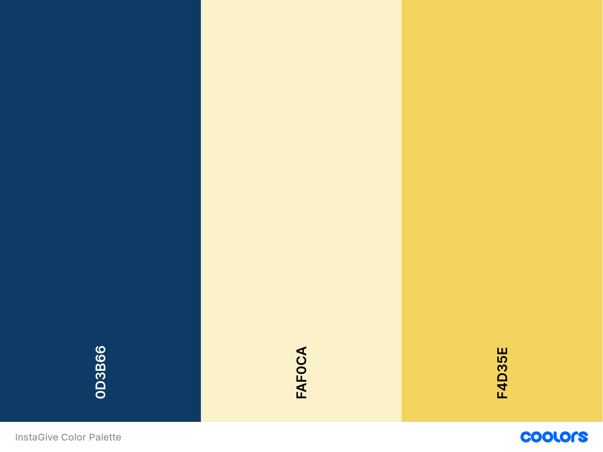

## Demo - Sprint 1

*	Install Vysor
*	Do a live demo
*	Post documents in the README.md
*	Icon/Logo of the app:  

* Color palette of the app:  

*	3-5 screenshots of the app:  

*	Video demo of the application (YouTube link)
*	Apk, link or equivalent (available at the root)
