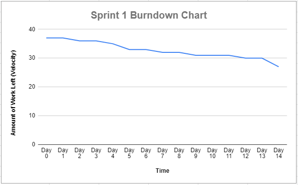
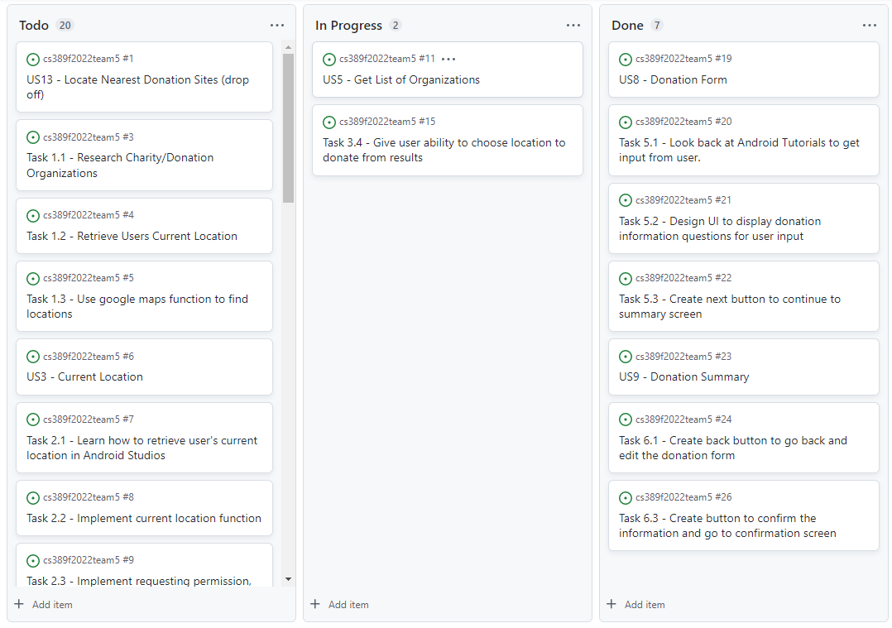

## Retrospective - Sprint 2

* Sprint Goal:
  *	Implement 3 User Stories
  *	User Stories: 
    * US13 - Locate Nearest Donation Sites (drop off)
    * US3 - Current Location
    * US5 - Get List of Organizations
    * US6 - Google Maps
    * US8 - Donation Form
    * US9 - Donation Summary
    * US10 - Donation Confirmation
  * Velocity: 37
    * H = 7 points, M = 5 points, L = 3 points
  * [Product Backlog - Sprint 1](https://docs.google.com/spreadsheets/d/1mZyLCKUbVGbjoeYFcOHvxQBhpQpaeleSNZBySZJPy2Q/edit#gid=1056044682)  

*	Number of **stories** planned versus implemented:
    * Planned: 7
    * Implemented: 2
      *	US8 , US9 

*	Planned versus actual **velocity**:
    *	Planned: 37
    *	Actual: 10  

*	Summary:
    *	What should the team start doing?
        * The team should start working together on User Stories and tasks that are similar to eachother to move past more difficult tasks that will be less challenging with both of us working on it. 
    *	What should the team stop doing?
        *	The team should stop dividing the work by User stories as well as overestimating the difficulty of our tasks. 
    *	What should the team continue doing?
        * The team should continue to execute great communication, share information and helpful resources to assist during programming. In addition, the team should continue to collaborate and stay positive during difficult periods. 

*	[Product Backlog](https://docs.google.com/spreadsheets/d/1mZyLCKUbVGbjoeYFcOHvxQBhpQpaeleSNZBySZJPy2Q/edit?usp=sharing)
    *	Only changed the Sprint for the USs that were not implemented in Sprint 1.
*	[Burndown Chart](https://docs.google.com/spreadsheets/d/1BHfbSvmevCo5q45GMup5iqZxVN3VJ4yxqTTAV3QHPEo/edit?usp=sharing)  

*	[ToDo Progress](https://github.com/orgs/paceuniversity/projects/7)  

*	[Statistics - GitHub Insights](https://github.com/paceuniversity/cs389f2022team5/pulse)
