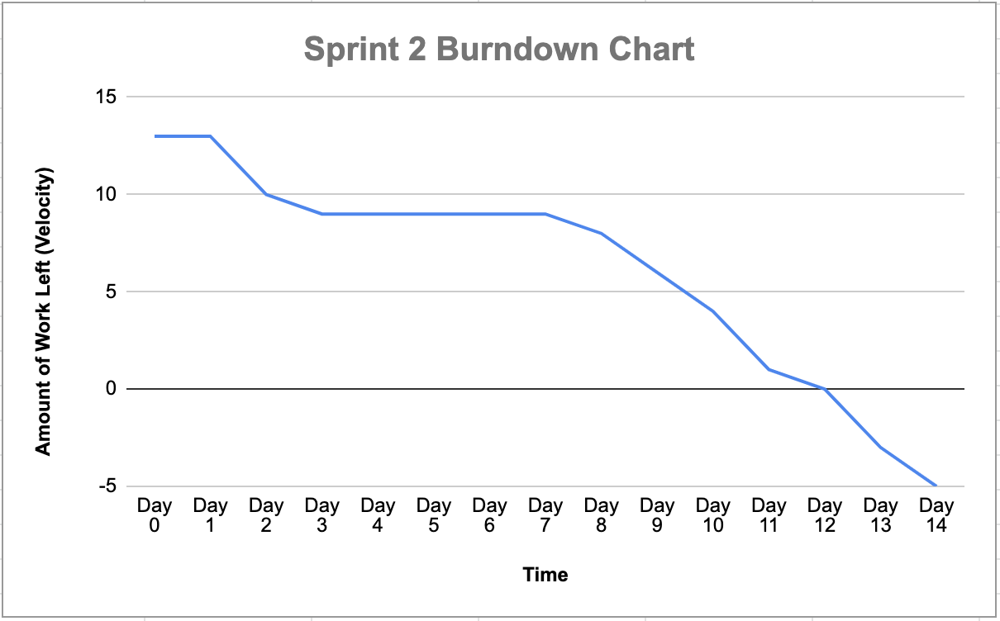

## Retrospective - Sprint 3

* Sprint Goal:
  *	Implement 4 User Stories
  *	User Stories: 
    * US3 - Current Location
    * US5 - Get List of Organizations
    * US7 - Description of Locations
  * Velocity: 13
    * H = 7 points, M = 5 points, L = 3 points
  * [Product Backlog - Sprint 2](https://docs.google.com/spreadsheets/d/1mZyLCKUbVGbjoeYFcOHvxQBhpQpaeleSNZBySZJPy2Q/edit#gid=816747650)  

*	Number of **stories** planned versus implemented:
    * Planned: 3
    * Implemented: 4
      *	US5 , US7 , US10 , US22 

*	Planned versus actual **velocity**:
    *	Planned: 13
    *	Actual: 18  

*	Summary:
    *	What should the team start doing?
        * The team should start having a more structured time frame to complete individual tasks and push individual changes more often. 
    *	What should the team stop doing?
        *	The team should stop dividing the work by User stories as well as overestimating the difficulty of our tasks. 
    *	What should the team continue doing?
        * The team should continue to execute great communication, share information and helpful resources to assist during programming. In addition, the team should continue to collaborate and stay positive during difficult periods. 

*	[Product Backlog](https://docs.google.com/spreadsheets/d/1mZyLCKUbVGbjoeYFcOHvxQBhpQpaeleSNZBySZJPy2Q/edit?usp=sharing)
    *	Changed which USs were implemented in Sprint 2.
*	[Burndown Chart](https://docs.google.com/spreadsheets/d/1BHfbSvmevCo5q45GMup5iqZxVN3VJ4yxqTTAV3QHPEo/edit?usp=sharing)  

*	[ToDo Progress](https://github.com/orgs/paceuniversity/projects/7)  
*	[Statistics - GitHub Insights](https://github.com/paceuniversity/cs389f2022team5/pulse)
