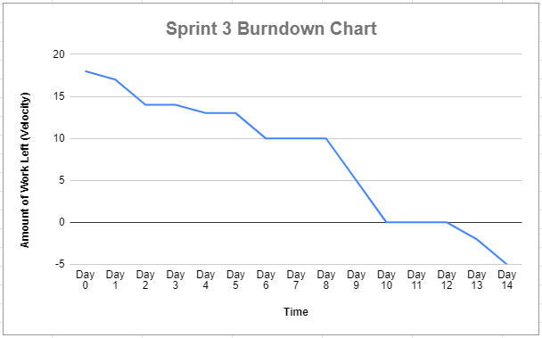

## Retrospective - Sprint 3

* Sprint Goal:
  *	Implement 4 User Stories
  *	User Stories: 
    * US2 - Login
    * US3 - Current Location
    * US12 - Get Donation History
    * US20 - Saving sessions

  * Velocity: 18
    * H = 7 points, M = 5 points, L = 3 points
  * [Product Backlog - Sprint 3](https://docs.google.com/spreadsheets/d/1mZyLCKUbVGbjoeYFcOHvxQBhpQpaeleSNZBySZJPy2Q/edit#gid=518266361)  

*	Number of **stories** planned versus implemented:
    * Planned: 4
    * Implemented: 5
      *	US2 - Login
      * US12 - Get Donation History
      * US20 - Saving sessions
      * US21 - Log out
      * US24 - Learn More

*	Planned versus actual **velocity**:
    *	Planned: 18  
    *	Actual: 23  

*	Summary:
    *	What should the team start doing?
        * The team should make sure the app is ready and prepare for the final presentation.
    *	What should the team stop doing?
        *	The team should stop overestimating the difficulty of our tasks and underestimating the time it takes to complete other backend (Firebase) tasks. 
    *	What should the team continue doing?
        * The team should continue to execute great communication, share information and helpful resources to assist during programming, esepecially during difficult times.

*	[Product Backlog](https://docs.google.com/spreadsheets/d/1mZyLCKUbVGbjoeYFcOHvxQBhpQpaeleSNZBySZJPy2Q/edit?usp=sharing)
    *	Changed some of the USs that were implemented in Sprint 3.
*	[Burndown Chart](https://docs.google.com/spreadsheets/d/1BHfbSvmevCo5q45GMup5iqZxVN3VJ4yxqTTAV3QHPEo/edit?usp=sharing)  

*	[ToDo Progress](https://github.com/orgs/paceuniversity/projects/7)  
*	[Statistics - GitHub Insights](https://github.com/paceuniversity/cs389f2022team5/pulse)
